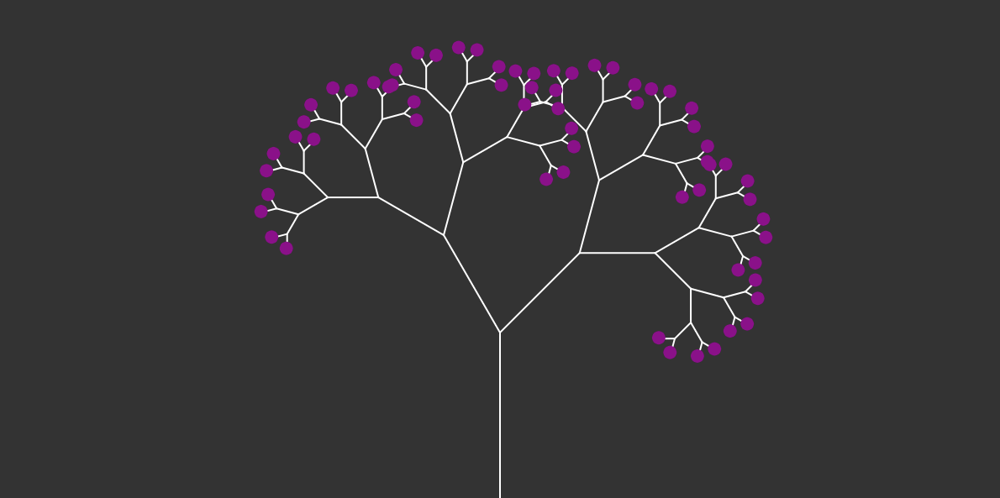

# fractal-trees

Fractal trees, the beginnings of an art project

## Upcoming features (things to think about)

- Allow users to play with angles, colors, lengths
- Animate drawing instead of using mousePressed
- Allow trees of any size (remove `count === 6` breakpoint)

## References

- [The Coding Train](https://www.youtube.com/channel/UCvjgXvBlbQiydffZU7m1_aw)
- [p5.js](https://p5js.org/)
